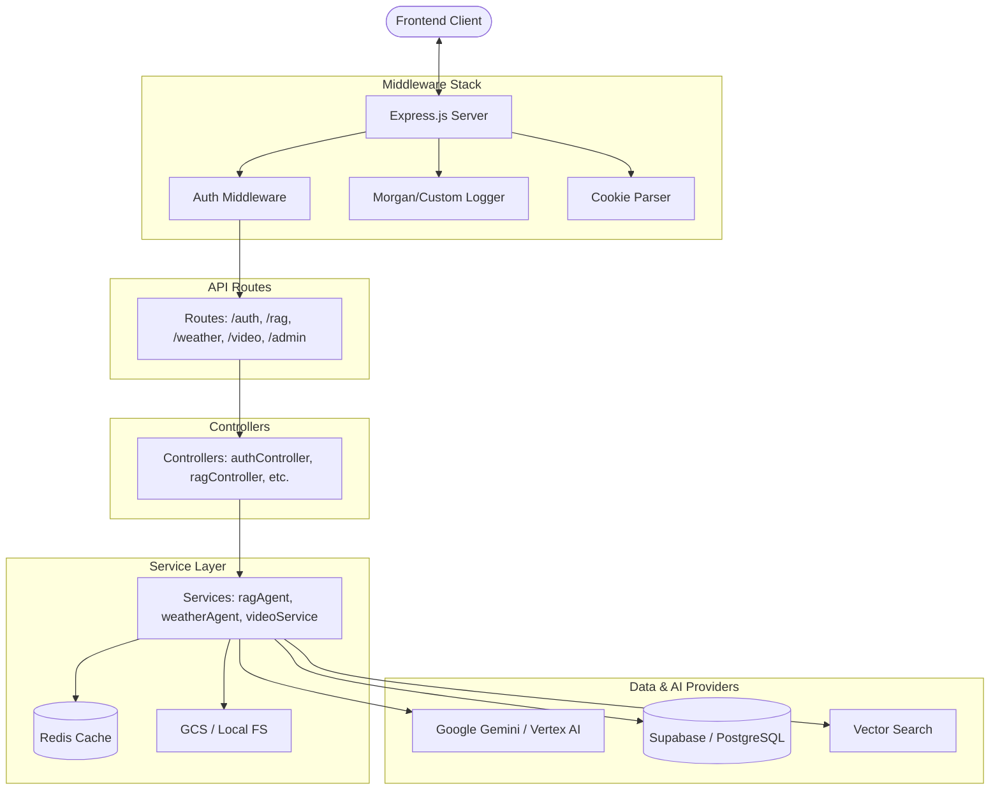

# AI Agents Backend

This is the backend API for the AI Agents Website, an Express.js server that orchestrates various AI agents, manages user sessions, and handles data ingestion and retrieval.

## 🏗️ Architecture Overview

The backend follows a standard **Controller-Service** pattern, with **Express.js** handling routing and middleware, and **Services** encapsulating the core business logic and AI provider integrations.

### Architecture Diagram



## 🛠️ Tech Stack

- **Runtime**: [Node.js](https://nodejs.org/) (>= 24.0.0)
- **Framework**: [Express.js](https://expressjs.com/)
- **Database**: [PostgreSQL](https://www.postgresql.org/) (via [Supabase](https://supabase.com/))
- **Caching**: [Redis](https://redis.io/)
- **AI/ML**: [Google Gemini](https://ai.google.dev/), [Vertex AI](https://cloud.google.com/vertex-ai), [@google/adk](https://www.npmjs.com/package/@google/adk)
- **Authentication**: [JWT (JSON Web Tokens)](https://jwt.io/)
- **File Handling**: [Multer](https://github.com/expressjs/multer)
- **OCR & Parsing**: [Tesseract.js](https://tesseract.projectnaptha.com/), [pdf-parse](https://github.com/cjihrig/pdf-parse), [xlsx](https://sheetjs.com/)

## 📂 Project Structure

- `src/config`: Environment variables, constants, and Redis setup.
- `src/controllers`: Request handlers that map API endpoints to service logic.
- `src/middlewares`: Security (JWT), logging, and request validation.
- `src/routes`: API endpoint definitions organized by feature.
- `src/services`: The core engine of the application.
    - `ragAgent.js`: Multi-format document parsing and RAG logic.
    - `weatherAgent.js`: Weather tool integration using ADK.
    - `videoV2Service.js`: Advanced video processing and search logic.
    - `ingestion/`: Specialized services for chunking, embedding, and vector storage.

## 📡 API Endpoints

| Category | Base Path | Description |
|----------|-----------|-------------|
| **Auth** | `/api/auth` | Login, logout, and token refresh. |
| **Weather** | `/api/agents/weather` | Weather Oracle (V1 & V2). |
| **RAG** | `/api/agents/rag` | Knowledge Oracle (Upload, Chat, Clear). |
| **Video** | `/api/video` / `/api/video-oracle-v2` | Video Oracle (V1 & V2). |
| **Ingestion** | `/api/ingestion` | Document ingestion for vector stores. |
| **Admin** | `/api/admin` | User and agent management (Admin only). |

## 🚀 Getting Started

1. **Install Dependencies**:
   ```bash
   npm install
   ```

2. **Setup Environment**:
   Create a `.env` file based on the configuration above.

3. **Run in Development Mode**:
   ```bash
   npm run dev
   ```

4. **Start Production Server**:
   ```bash
   npm start
   ```

---
Created by Gemini CLI Agent
